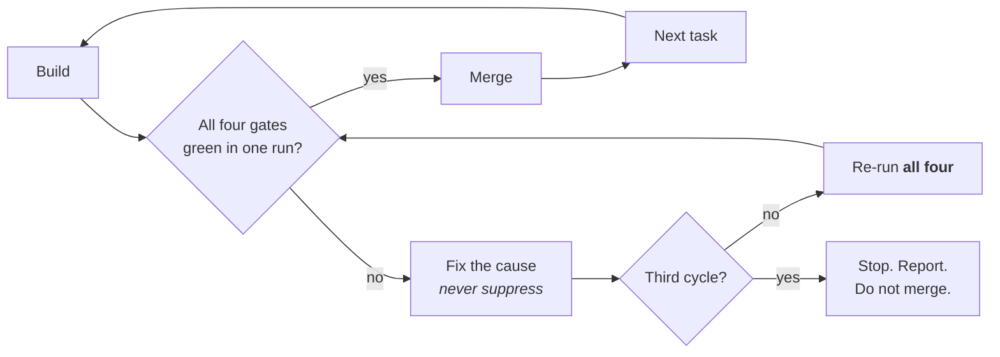

# Development Workflow

Work in this repository moves through a loop: **plan → build → gate → merge → next task.**
The gate is what makes the rest trustworthy. Everything below exists so that a change
which reaches the default branch is documented, checked, and safe — and so that anyone
reading the transcript later can see the evidence rather than take your word for it.

Apply this to every task in the session, not just the first one.

## 1. Plan

Before editing, state in one or two sentences what changes and which gates apply.
The image gate is conditional (see §3.4); the other three always apply. Naming them up
front stops the gates from becoming an afterthought bolted on at merge time — the point
is that each is a step of the work, not a toll booth at the end.

Work on a branch, never directly on the default branch.

## 2. Build

Write the code and its supporting artifacts **in the same commit**, not in a follow-up:

- **Code** — the change itself, plus tests that fail without it. A test that passes
  against the unmodified code proves nothing.
- **Docs** — update whatever describes the behavior you changed (§3.1).
- **Images** — capture or update them if §3.4 applies.

Deferring docs to "later" is how they rot; later never arrives, and the person who
needed them has already read the wrong thing.

## 3. The gate set

Run all four gates before merging. Run `scripts/run_gates.sh` for the mechanical
portion — it detects the stack, runs what exists, and prints a ledger:

```bash
.claude/skills/development-workflow/scripts/run_gates.sh [base-ref]
```

The script covers what a script can decide. The judgment calls — is this documented,
is this finding real, does this change need a diagram — are yours. Read
`references/gates.md` for the per-gate checklists when you need the detail.

### 3.1 Documentation

Every behavioral change updates the docs that describe it:

- README, or the page under `docs/` that covers the area
- Public API docstrings and comments on anything whose contract moved
- A changelog entry
- New modules open with a statement of what they are for

Internal-only refactors with no contract change need no doc update — say so in the
ledger rather than inventing one.

### 3.2 Security testing

Run the `security-review` skill against the pending diff, plus the script's dependency
audit and secret scan. Cover:

- Dependency advisories in anything newly added or bumped
- Secrets and credentials in the diff — keys, tokens, connection strings
- Injection and authorization review of every new input path or endpoint
- Unsafe defaults in new configuration (permissive CORS, disabled verification,
  debug flags, wide file permissions)

Triage every finding. Anything you do not fix needs a written justification in the
ledger explaining why it is acceptable here. "No findings" is a legitimate result; an
unrun scan is not.

### 3.3 Code checks

Formatter, linter, type checker, unit and integration tests, and a clean build —
whichever of these the detected stack actually provides. Then run the `code-review`
skill over the diff.

Coverage must not regress. If the repo has no coverage tooling, note that instead of
claiming a number you did not measure.

### 3.4 Image generation — when necessary

This gate is conditional, and treating it as mandatory produces noise nobody reads.

**Required when:**
- The change alters user-visible UI → capture a before/after screenshot of the app
  actually running (the `run` skill launches it).
- The change alters architecture, data flow, or a state machine → produce or update a
  diagram.

**Not required** for a backend refactor, a bug fix with no structural or visual effect,
a dependency bump, or a docs-only change. Record it as N/A with the reason.

When it does apply: images go in `docs/images/`, are referenced from the doc they
support, and carry alt text describing what the reader should see.

## 4. When a gate fails

This protocol is the part that actually protects the branch, so follow it literally.




1. **Fix the cause.** Do not disable the check, raise a threshold, add a suppression or
   ignore comment, delete or skip the failing test, or reclassify the gate as N/A to get
   past it. Those all convert a visible failure into an invisible one, which is strictly
   worse than the red you started with. If a check is genuinely wrong, fix the check as
   its own change and explain it in the ledger.
2. **Re-run the entire gate set from the start** — all four, not just the one that
   failed. Your fix touched the tree, so every earlier result is now stale. This is the
   step that gets skipped under time pressure and it is the step that catches the bug
   the fix introduced.
3. **Repeat, capped at 3 full cycles.** If the third cycle is still red, stop. Do not
   merge. Report what fails, what you tried, and what you would do next. Three failed
   cycles usually means the problem is upstream of the code, and grinding a fourth time
   rarely finds it.
4. **One uninterrupted green run of all four gates authorizes the merge** — a green
   result carried over from before the last edit does not.

## 5. Ledger

Print this before the merge decision. It exists because "checks pass" is a claim, and a
claim needs evidence someone can re-run:

```
| Gate          | Result | Evidence                                    |
|---------------|--------|---------------------------------------------|
| Documentation | PASS   | README.md §Config, CHANGELOG.md updated     |
| Security      | PASS   | security-review: 0 findings; audit exit 0   |
| Code checks   | PASS   | lint/typecheck/test/build exit 0; 142 tests |
| Images        | N/A    | backend-only, no UI or structural change    |
```

Rules that keep the ledger honest:

- Evidence is a command and its exit code, or a file that changed. Not "looks fine".
- A gate you did not execute is **FAIL**, not PASS. Unknown is not success.
- **N/A** requires a reason, and is only for tooling the repo does not have or a
  conditional gate that does not apply — never as an escape from a failure.

## 6. Merge and continue

Merge only on a fully green ledger. Then state what shipped, and carry the same loop
into the next task — including the branch, including the gates.

Open a pull request only if the user asks for one.

## 7. Stack detection

Never assume a command exists. Resolve in this order, first hit wins:

1. **Explicit project config** — `package.json` scripts, `Makefile`, `justfile`,
   `pyproject.toml`, `Cargo.toml`, `go.mod`, or the CI workflow files under
   `.github/workflows/`. What CI runs is the most reliable signal of what the project
   considers a passing build.
2. **Ecosystem defaults** — see `references/stack-commands.md`.
3. **Nothing available** — record the gate as N/A with the reason. Do not invent a
   command, and do not report a gate as passing because there was nothing to run.

When this repo gains its first real toolchain, add its commands to
`references/stack-commands.md` so the next task inherits them.

## Reference files

- `references/gates.md` — per-gate checklists and triage guidance
- `references/stack-commands.md` — per-ecosystem commands for each mechanical gate
- `scripts/run_gates.sh` — stack detection, mechanical gates, ledger rows
