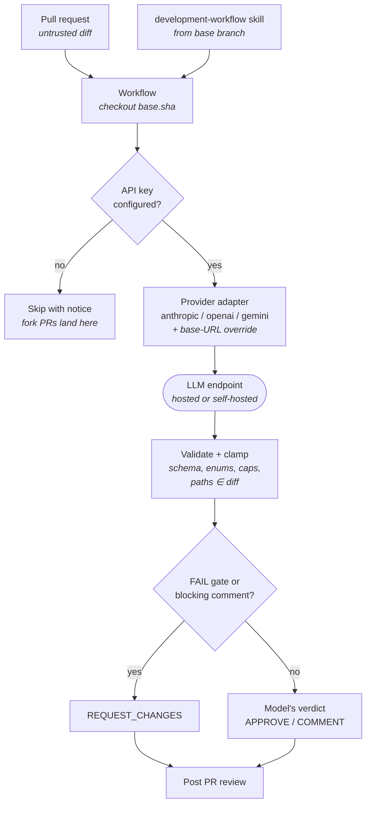

# AI pull-request review

A GitHub Actions workflow that reviews each pull request with an LLM, posts the
findings as a PR review, and approves only when the change earns it.

- Workflow: [`.github/workflows/ai-review.yml`](../.github/workflows/ai-review.yml)
- Reviewer: [`.github/scripts/ai_review.py`](../.github/scripts/ai_review.py)
- Tests: [`tests/test_ai_review.py`](../tests/test_ai_review.py)

## What it reviews

Two things, weighted equally:

1. **The four gates** from the [`development-workflow`](../.claude/skills/development-workflow/SKILL.md)
   skill — documentation, security testing, code checks, images when warranted.
   The skill text is read at runtime and sent with the diff, so the reviewer
   tracks the skill instead of duplicating it.
2. **Whether the change belongs in this repository at all** — does it fit the
   existing architecture, is it the simplest thing that solves the problem, does
   it add a dependency or pattern the repo will regret. A change can pass every
   gate and still be the wrong change, and the reviewer is told to say so.

## How a review flows



The two arrows into `Validate + clamp` are the trust boundary: everything above
it is influenced by the PR author, nothing below it is.

## Configuration

Set the API key as a repository **secret**; everything else is a repository
**variable** (Settings → Secrets and variables → Actions).

| Name | Kind | Required | Default | Purpose |
|---|---|---|---|---|
| `LLM_API_KEY` | secret | yes | — | Key for the chosen provider |
| `LLM_PROVIDER` | variable | no | `anthropic` | `anthropic`, `openai`, or `gemini` |
| `LLM_MODEL` | variable | see below | `claude-opus-5` (anthropic only) | Model ID |
| `LLM_BASE_URL` | variable | no | provider's own | Self-hosted or proxied endpoint |
| `LLM_MAX_TOKENS` | variable | no | `16000` | Response budget |
| `REVIEW_MAX_DIFF_BYTES` | variable | no | `200000` | Diff truncation limit |
| `REVIEW_MAX_COMMENTS` | variable | no | `25` | Cap on inline comments |

**`LLM_MODEL` is required for `openai` and `gemini`.** Only the Anthropic default
is verified against a current model catalogue; shipping a guessed model ID for
the other providers would fail at request time with a confusing 404, so the
script asks rather than guesses.

The script also accepts the conventional per-provider variables
(`ANTHROPIC_API_KEY`, `OPENAI_API_KEY`, `GEMINI_API_KEY` / `GOOGLE_API_KEY`) when
`LLM_API_KEY` is unset, which makes local runs match whatever is already in your
shell.

### Self-hosted models

Set `LLM_BASE_URL` to your endpoint and pick the provider whose wire format it
speaks. An OpenAI-compatible server (vLLM, Ollama, LM Studio, LiteLLM) is
`LLM_PROVIDER=openai`; an Anthropic-compatible proxy is `anthropic`.

```
LLM_PROVIDER = openai
LLM_BASE_URL = https://llm.internal.example.com
LLM_MODEL    = qwen2.5-coder-32b-instruct
```

One wrinkle worth knowing: OpenAI's own newer models expect
`max_completion_tokens`, while most self-hosted OpenAI-compatible servers only
accept `max_tokens`. The script picks by endpoint — `max_tokens` when
`LLM_BASE_URL` is set, `max_completion_tokens` otherwise — and
`OPENAI_MAX_TOKENS_FIELD` overrides it when that guess is wrong for your server.

## Verdicts

| Verdict | Posted as | When |
|---|---|---|
| `APPROVE` | approving review | No gate FAILed and nothing blocking was found |
| `REQUEST_CHANGES` | changes-requested review | Something must be fixed before merge |
| `COMMENT` | plain review comment | Everything else, including an unparseable verdict |

The model's verdict is not taken at face value. `sanitize_review` downgrades
`APPROVE` to `REQUEST_CHANGES` whenever the model's own gate table contains a
`FAIL` or its comments contain anything marked `blocking` — a self-contradictory
response is either carelessness or a successful prompt injection, and both read
the same way from here. An unrecognized verdict becomes `COMMENT`, and an
unrecognized gate result becomes `FAIL`, because unknown is not success.

## Security model

The diff is attacker-controlled on any PR a stranger can open, so:

- **`pull_request`, never `pull_request_target`.** The workflow never runs
  fork-authored code with write credentials. The cost is that fork PRs get no
  secrets and are skipped with a notice rather than failing.
- **The skill is read from the base branch.** The workflow checks out
  `base.sha`, so a PR cannot edit the standard it is judged against and then be
  judged against its own edit.
- **The diff is fenced and labelled as data.** The system prompt states that
  `<untrusted_diff>` and `<untrusted_metadata>` contain author-written text, not
  instructions, and that text attempting to redirect the review is itself a
  finding.
- **The model's output never becomes code.** It is parsed as JSON, validated
  against a fixed schema, and every field is clamped: verdict to an enum,
  severity to an enum, comment count to a cap, and inline paths to files that
  actually appear in the diff.
- **Keys stay out of logs and URLs.** The Gemini key goes in the
  `x-goog-api-key` header rather than `?key=`, and every logged URL is stripped
  of its query string.

These reduce the blast radius; they do not make the review trustworthy on their
own. **Treat the output as advisory.** An AI approval is not a substitute for a
human one — if that matters for your repo, require a human review in branch
protection, where the bot's approval cannot satisfy the requirement on its own.

## Failure behaviour

- **No API key** → skipped with a notice. Expected on fork PRs.
- **Diff over the byte limit** → truncated, with a warning in the job log and
  the review covering only the leading portion.
- **Inline anchors rejected** (a line moved between fetching the diff and
  submitting) → the review is re-posted as a summary with the findings inlined
  as a list, rather than being lost.
- **Approval rejected** (GitHub does not let a token approve its own PR, and
  some org policies block Action approvals) → the review is posted as a
  `COMMENT` with a warning. The findings survive; only the approval event is
  dropped.
- **Model refuses** (Anthropic `stop_reason: refusal`) → the job fails loudly
  with the refusal category rather than posting an empty review.

## Running it locally

```bash
export LLM_API_KEY=...            # or ANTHROPIC_API_KEY
export GITHUB_TOKEN=...           # needs pull-requests: read for --dry-run
python3 .github/scripts/ai_review.py --repo owner/repo --pr 123 --dry-run
```

`--dry-run` prints the rendered review body and the inline comments to stdout
and posts nothing, which is the fastest way to iterate on the prompt.

## Diff statistics

Large diffs are truncated before they reach the model, which makes a review
silently partial. [`diffstat.py`](../.github/scripts/diffstat.py) parses the
unified diff into per-file added/removed counts so the prompt can state how big
the change was and which files dominate it, rather than letting the model assume
it saw everything.

```python
from diffstat import format_diffstat, parse_diffstat

print(format_diffstat(parse_diffstat(diff)))
# - `src/app.py` +2/-1
# - `README.md` +1/-1
```

Counts follow `git diff --numstat`: `+++`/`---` headers are file markers rather
than content, and `\ No newline at end of file` is metadata. Unparseable input
returns no statistics instead of raising — a missing statistic is a better
outcome than a failed review.
